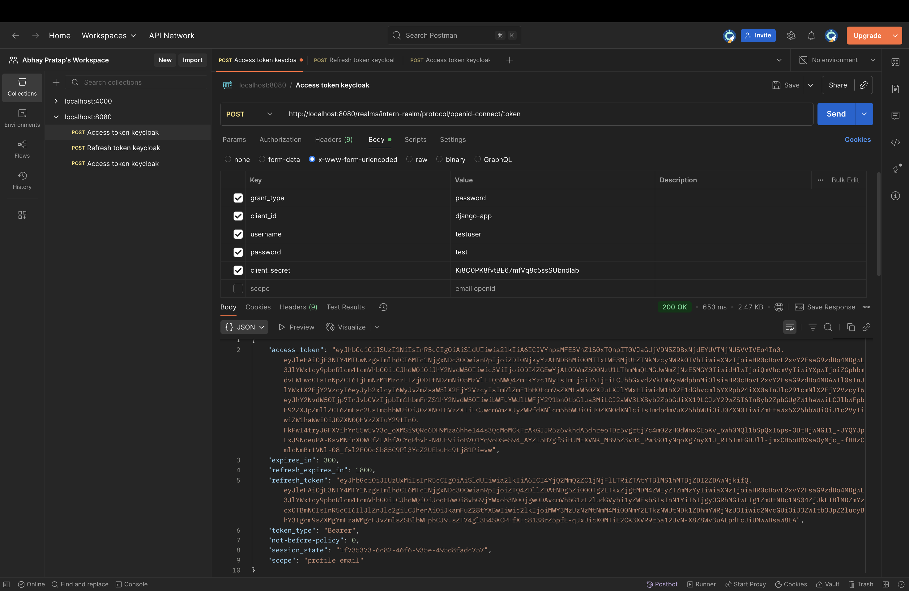

# Request & Decode Keycloak Tokens

## 1. Get Access Token (via curl)

```bash
curl -X POST \
  "http://localhost:8080/realms/myrealm/protocol/openid-connect/token" \
  -H "Content-Type: application/x-www-form-urlencoded" \
  -d "client_id=django-app" \
  -d "client_secret=CLIENT_SECRET" \
  -d "username=testuser" \
  -d "password=testpassword" \
  -d "grant_type=password"
```

This returns a json like:

```
{
  "access_token": "eyJhbGciOiJSUzI1NiIsInR5cCI6...",
  "refresh_token": "eyJhbGciOiJIUzI1NiIsInR5cCI6...",
  "id_token": "eyJhbGciOiJSUzI1NiIsInR5cCI6..."
}
```

## Get Access Token (via postman)



## 2. Decode the JWT (via terminal)

```bash
brew install jwt-cli
echo "token" | jwt decode | jq
```

## Decode the JWT (via jwt.io)


## 3. Meaning of Tokens

- **Access Token**: short-lived, used to access APIs.
- **Refresh Token**: longer-lived, used to get new access tokens.
- **ID Token**: contains profile info (name, email, username, etc).
