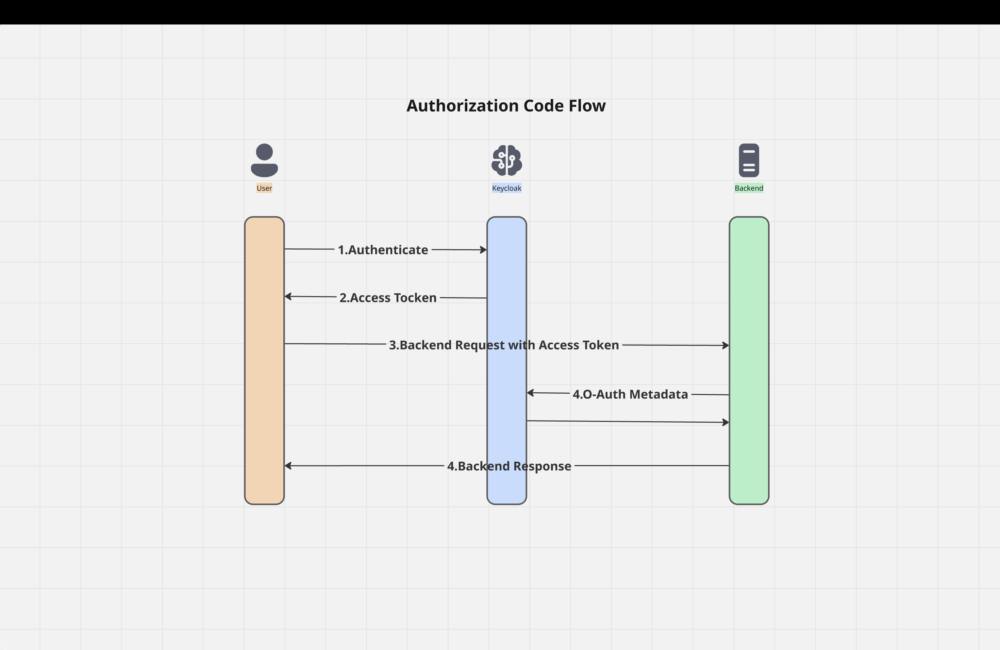

# Keycloak Authorization Code Flow



## 1. Example Redirect URL:

```bash
http://localhost:8080/realms/myrealm/protocol/openid-connect/auth
   ?client_id=django-app
   &response_type=code
   &scope=openid profile email
   &redirect_uri=http://localhost:8000/callback
```

- client_id: the app registered in Keycloak.
- response_type=code: Authorization Code Flow.
- scope: info we want in tokenID
- redirect_uri: where user is redirected after login.

## 2. After Login

- Keycloak redirects back to the app with

```example
http://localhost:8000/callback?code=abc123&session_state=xyz
```

## 3. App Exchange the Code for Tokens

```bash
curl -X POST \
  "http://localhost:8080/realms/myrealm/protocol/openid-connect/token" \
  -H "Content-Type: application/x-www-form-urlencoded" \
  -d "client_id=django-app" \
  -d "client_secret=CLIENT_SECRET" \
  -d "grant_type=authorization_code" \
  -d "code=abc123" \
  -d "redirect_uri=http://localhost:8000/callback"
```

Response will include:

```
{
  "access_token": "eyJhbGciOiJSUzI1NiIsInR5cCI6...",
  "refresh_token": "eyJhbGciOiJIUzI1NiIsInR5cCI6...",
  "id_token": "eyJhbGciOiJSUzI1NiIsInR5cCI6..."
}
```

## 4. Use in the app/backend

- Access Token: attach to API requests (Bearer token).
- ID Token: parse it to get user info (username, email, etc.).
- Refresh Token: request new access tokens when expired.
