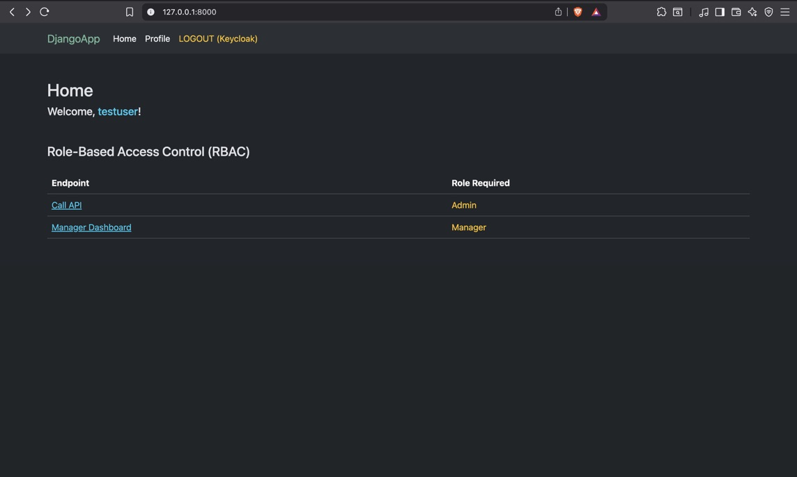
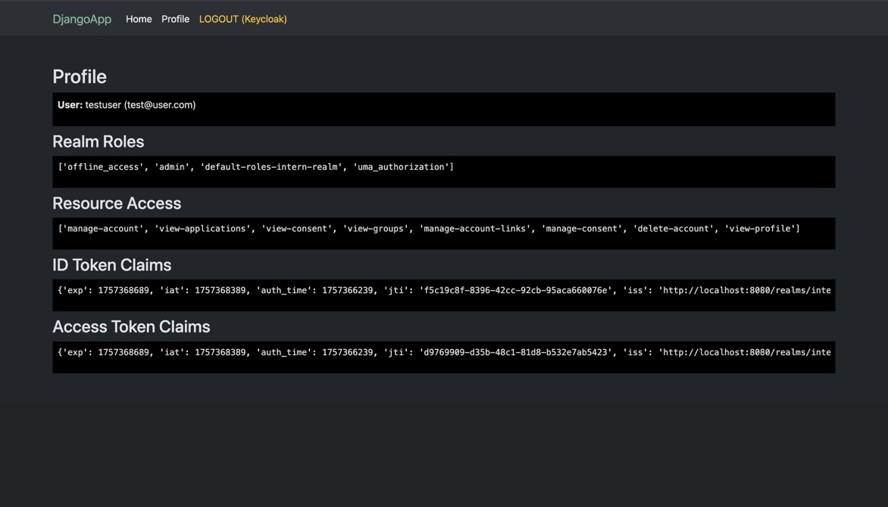
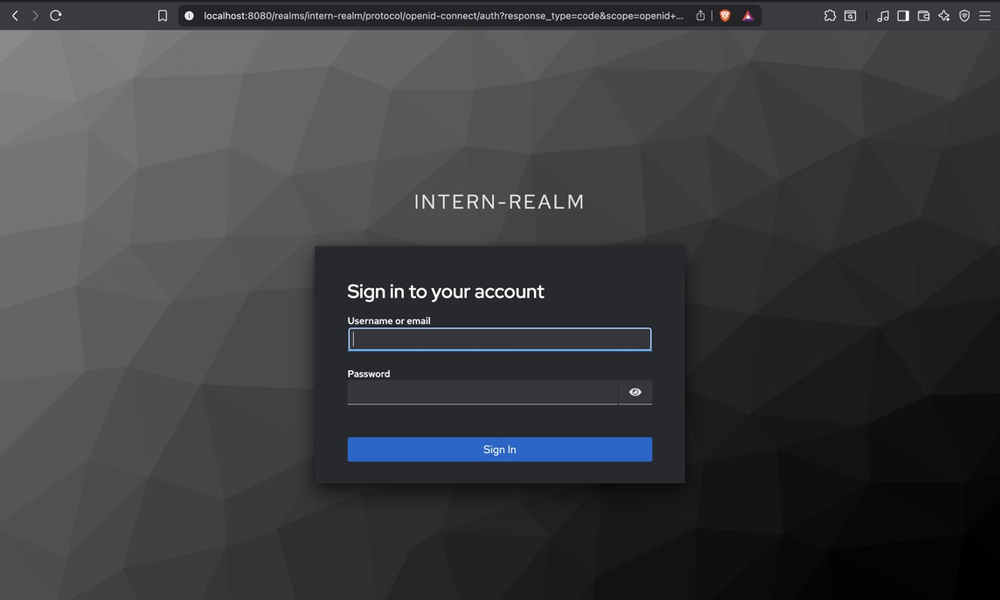

# Django + Keycloak SSO Integration

This project demonstrates how to integrate a Django web application with Keycloak using the OpenID Connect (OIDC) Authorization Code Flow. Users authenticate via Keycloak (Single Sign-On), and Django consumes the ID token / access token to manage sessions, protect views, and call external APIs.

## Features

- Login with Keycloak (OIDC Authorization Code Flow)
- Logout (redirect back to Keycloak)
- Protect Django views with custom decorators
- Fetch and display user profile claims (username, email, roles)
- Call an external API using the access token (example: httpbin.org/bearer)
- Extendable to protect Django REST Framework APIs

## Prerequisites:

1. Python 3.10+
2. Virtual environment
3. Django 4+
4. Keycloak server running (via Docker or your existing setup)

## Setup

1. Clone repository

```bash
git clone https://github.com/AbhayPratap05/Learning-SSO.git
cd 3-Django-App
```

2. Create and activate virtual environment

```bash
python -m venv .venv
source .venv/bin/activate  # Linux/Mac
```

3. Install dependencies

```bash
pip install -r requirements.txt
```

4. Configure Keycloak

- Create a Realm (e.g. intern-realm).
- Create a Client (e.g. django-app).
  - Access type: confidential
  - Valid redirect URIs:
  ```
      http://127.0.0.1:8000/oidc/callback/
      http://localhost:8000/oidc/callback/
      http://127.0.0.1:8000/
      http://localhost:8000/
  ```
  - Logout redirect URIs:
  ```
  http://127.0.0.1:8000/
  ```
- Create a User, set credentials.
- Assign Roles (optional).

5. Configure Django

- settings.py:

  ```
  # -------- OIDC settings (mozilla-django-oidc) --------
  KEYCLOAK_ISSUER = os.getenv("KEYCLOAK_ISSUER", "").rstrip("/")
  OIDC_RP_CLIENT_ID = os.getenv("OIDC_CLIENT_ID")
  OIDC_RP_CLIENT_SECRET = os.getenv("OIDC_CLIENT_SECRET")

  # OIDC ENDPOINTS
  OIDC_OP_AUTHORIZATION_ENDPOINT=f"{KEYCLOAK_ISSUER}/protocol/openid-connect/auth"
  OIDC_OP_TOKEN_ENDPOINT=f"{KEYCLOAK_ISSUER}/protocol/openid-connect/token"
  OIDC_OP_USER_ENDPOINT=f"{KEYCLOAK_ISSUER}/protocol/openid-connect/userinfo"
  OIDC_OP_JWKS_ENDPOINT = f"{KEYCLOAK_ISSUER}/protocol/openid-connect/certs"
  ```

- Run the Application
  ```
  python manage.py migrate
  python manage.py runserver
  ```

## Example Views

- **/** -> Home (public)
- **/profile/** -> Protected page showing claims
- **/call-api/** -> Calls external API with access token (role required = admin)
- **/manager/** -> Returns json. To demonstrate role based access controls
- **/logout/** -> Logs out from Keycloak

## Future Improvements

- Secure Django REST Framework endpoints with Keycloak JWT auth
- UI improvements

## Project Structure

.
├── core/ # Django app
| |
│ ├── urls.py # url endpoints
│ ├── views.py # Views (home, profile, call-api)
│ ├── decorators.py # Login/role protection
│ └── utlis.py # Check valid access token
│ └── utlis.py # How users are created/updated from claims
│ └── ...  
│ └── templates # Templates (base, home and profile)
|  
├── kc_demo/ # Project settings
│ ├── settings.py
│ ├── urls.py
│ └── ...
|
├── Screenshots
│ ├── ...
|
├── manage.py
├── db.sqlite3
├── .env
├── requirements.txt
└── documentation.md # This file

## Screenshots:




