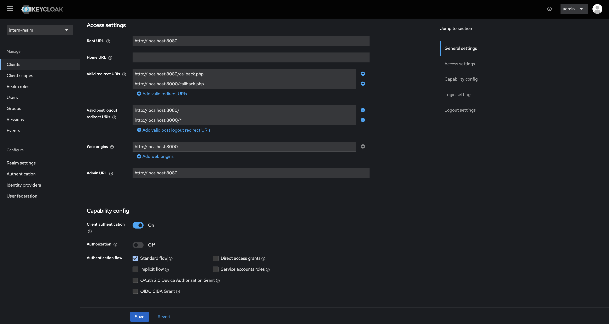

# Django + Keycloak SSO Integration

This project demonstrates how to integrate a plain PHP application with Keycloak for Single Sign-On (SSO) using the OIDC Authorization Code Flow.

## Features

- User authentication with Keycloak
- Session & token management (Access, ID, Refresh tokens)
- Role-based access control (Realm & Client roles)
- Custom claims via Keycloak mappers
- Calling a protected API with Bearer token (example: httpbin.org/bearer)
- Secure logout (local + SSO)

## Prerequisites:

1. PHP 8+
2. Composer (PHP package manager)
3. Keycloak server running (via Docker or your existing setup)

## Setup

1. Clone repository

```bash
git clone https://github.com/AbhayPratap05/Learning-SSO.git
cd 4-PHP-App
```

2. Install dependencies

```bash
composer require jumbojett/openid-connect-php
```

3. Configure Keycloak

- Create a Realm (e.g. intern-realm).
- Create a Client (e.g. php-app).
  - Access type: confidential
  - Authorization: off
  - Direct Access Grants: off
  - Service Account Roles: off
  - Valid redirect URIs:
  ```
      http://localhost:8080/callback.php
      http://localhost:8000/callback.php
  ```
  - Root URL + Admin URL:
  ```
  http://localhost:8080
  ```
  - Web Origins:
  ```
  http://localhost:8000
  ```
  - Logout redirect URIs:
  ```
  http://localhost:8080/
  http://localhost:8000/*
  ```
- Create a User, set credentials.
- Assign Roles (optional).

4. Configure PHP

- public/config.php:

  ```
  <?php
  return [
    'KEYCLOAK_BASE_URL' => 'http://localhost:8080',
    'REALM'             => 'REALM-NAME',
    'CLIENT_ID'         => 'CLIENT-ID',
    'CLIENT_SECRET'     => 'CLIENT-SECRET',
    'APP_URL'           => 'http://localhost:8000',
    'REDIRECT_PATH'     => '/callback.php',
  ];

  ```

5. Start PHP App

```bash
php -S localhost:8000 -t public
```

## Example Views

- **/** -> Home (public)
- **/profile/** -> Protected page showing claims
- **/call-api/** -> Calls external API with access token (role required = admin)
- **/manager/** -> To demonstrate role based access controls (client role required = manager)
- **/logout/** -> Logs out from Keycloak

## Project Structure

```
php-app/
│── public/
│   ├── index.php       # Homepage
│   ├── login.php       # Start login
│   ├── callback.php    # OIDC callback & token handling
│   ├── profile.php     # Show user profile, tokens, roles
│   ├── call_api.php    # Call external API with Bearer token
│   ├── auth.php        # Helper functions (Valid Access Token + Role Protection)
│   ├── manager.php     # Role protected page
│   ├── template.php    # Base template for app
│   ├── config.php      # Stores keycloak info and secretes
│   ├── logout.php      # Local + Keycloak logout
│── src/
│   ├── config.php      # App + Keycloak settings
│   ├── auth.php        # Helpers (token refresh, role checks)
│── vendor/             # Composer dependencies
```

## Screenshots:



