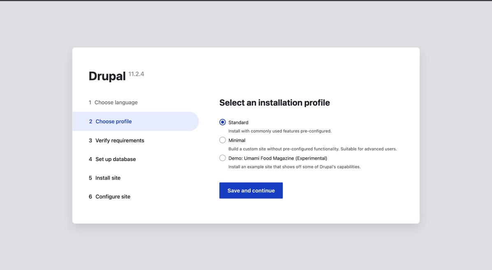
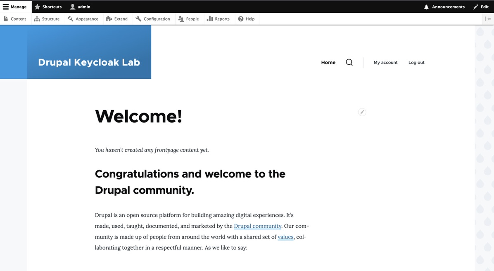
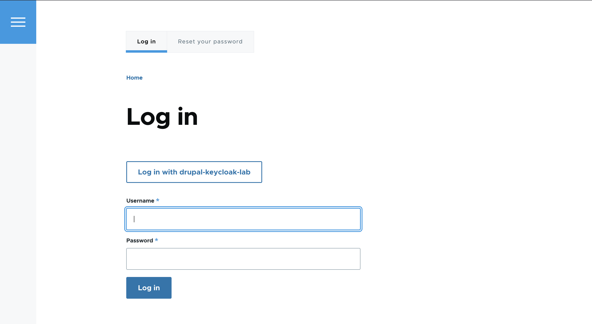
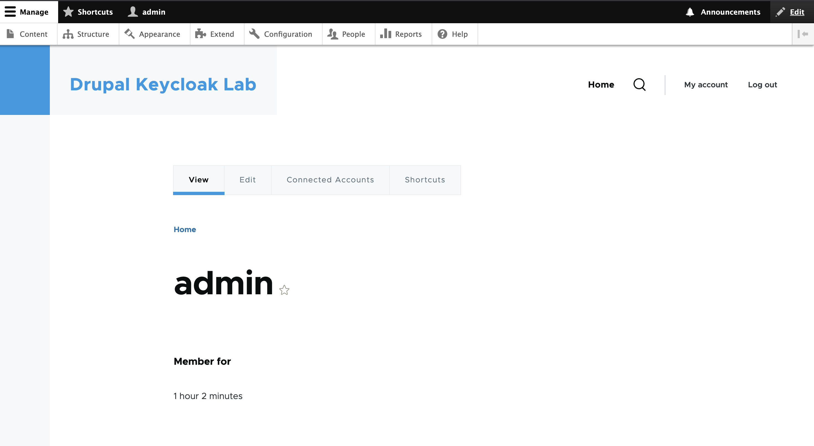
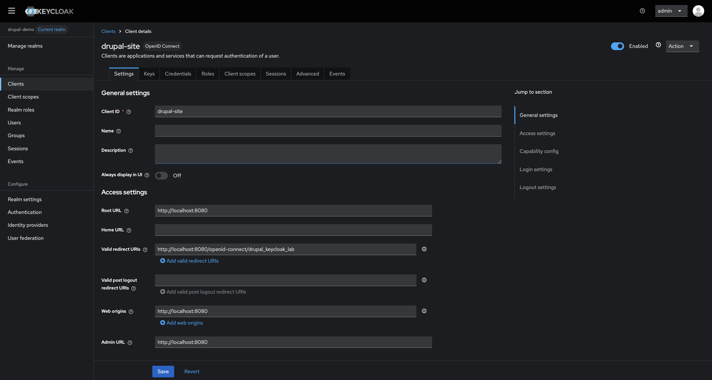

# Drupal 11 + Keycloak SSO Integration

This project demonstrates integrating Drupal 11 with Keycloak using OpenID Connect (OIDC) for Single Sign-On (SSO).

## Features

- Drupal 11 serves as the CMS (web application)
- Keycloak acts as the Identity Provider (IdP).
- Users authenticate via Keycloak and log into Drupal with/without separate Drupal credentials.

## Prerequisites:

1. Docker & Docker Compose
2. Composer

## Setup

1. Project structure

```bash
drupal-keycloak/
│── docker-compose.yml
│── drupal/ (composer-managed Drupal codebase)
```

2. docker-compose.yml

```yaml
version: "3.8"
services:
  db:
    image: mariadb:10.11
    restart: unless-stopped
    environment:
      MYSQL_DATABASE: drupal
      MYSQL_USER: drupal
      MYSQL_PASSWORD: drupal
      MYSQL_ROOT_PASSWORD: drupalroot
    volumes:
      - db_data:/var/lib/mysql

  drupal:
    image: drupal:11-apache
    restart: unless-stopped
    ports:
      - "8080:80"
    depends_on:
      - db
    volumes:
      - ./drupal/web:/var/www/html
      - ./drupal/web/sites/default/files:/var/www/html/sites/default/files

  keycloak:
    image: quay.io/keycloak/keycloak:latest
    command: ["start-dev"]
    environment:
      KC_BOOTSTRAP_ADMIN_USERNAME: "admin"
      KC_BOOTSTRAP_ADMIN_PASSWORD: "admin"
    ports:
      - "8081:8080"
    volumes:
      - keycloak_data:/opt/keycloak/data

volumes:
  db_data:
  keycloak_data:
```

3. Bring services up

```bashdocker compose up -d

```

Run drupal and complete installation

- Database: drupal, user: drupal, pass: drupal, host: db.

```
http://localhost:8080
```

Run keycloak

```
http://localhost:8081
```

4. Install OpenID Connect & Keycloak modules

```bash
cd drupal
composer require "drupal/openid_connect:^3.0@alpha" "drupal/keycloak:^2.2" "drupal/keycloak_user_sync"
```

Enable modules:

```bash
docker compose exec drupal bash -lc "vendor/bin/drush en openid_connect keycloak keycloak_user_sync -y && vendor/bin/drush cr"
```

5. Configure Keycloak

- Create a Realm (e.g. drupal-demo).
- Create a Client (e.g. drupal-site).
  - Protocol: openid-connect
  - Access type: confidential
  - Authorization: off
  - Direct Access Grants: off
  - Service Account Roles: off
  - Valid redirect URIs:
  ```
      http://localhost:8080/openid-connect/drupal_keycloak_lab
  ```
  - Root URL + Admin URL:
  ```
  http://localhost:8080
  ```
  - Web Origins:
  ```
  http://localhost:8000
  ```
- Create a User, set credentials.
- Add Mappers (optional)
  - Group Membership -> Claim name: groups
  - Roles exposed by default in tokens.

6. Configure Drupal

In Drupal admin -> Configuration -> People -> OpenID Connect -> Add client:

- Name: drupal-keycloak-lab
- Client ID: drupal-site
- Client Secret: <paste from Keycloak>
- Keycloak base URL: http://localhost:8081
- Keycloak Realm: drupal-demo
- Redirect URL: (auto-generated)

  Options (enable the following):

- Update email address in user profile
- Replace Drupal login with Keycloak SSO (optional)
- Enable user role mapping (if using groups/roles)

7. Role/Group Mapping:

- Keycloak side

  - Create groups: editor, manager
  - Assign users to groups.

- Drupal side

  - Create matching roles in Drupal (Admin -> People -> Roles).
  - Enable “user role mapping” in client config.
  - Map Keycloak claim groups -> Drupal roles.

8. Test Login / Logout Flow

- In a private window -> go to http://localhost:8080/user/login
- Click Log in with Keycloak
- Redirects to Keycloak login page -> login with a test user.
- Redirected back to Drupal -> user created/updated, roles applied.
- Logout test: Drupal logout triggers Keycloak logout.

9. Display User Claims

- Enable claim-to-field mapping in OpenID Connect client settings.
- Map given_name, family_name, email -> Drupal fields.
- Display on user profile page via Drupal’s field display settings.

## Screenshots:






